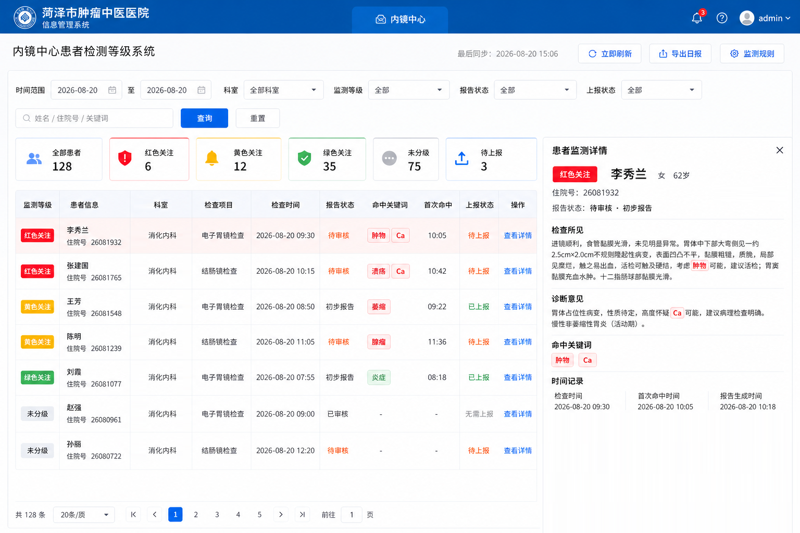
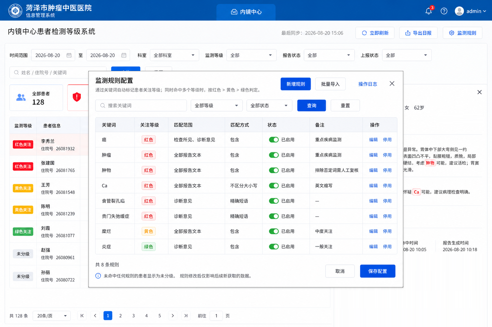

# 内镜重点患者监测系统 PRD

> 建设单位：菏泽市肿瘤中医医院  
> 业务部门：内镜中心 / 医务管理相关部门  
> 文档版本：V1.1（合并版）  
> 文档状态：需求确认稿，可进入原型评审与接口联调  
> 编写日期：2026-08-21  
> 目标读者：院领导、内镜中心、信息科、开发与测试人员  
> 依据材料：`Doc/首页.png`、`Doc/规则配置.png`、《内镜重点患者监测系统_PRD_V1.0》、《PACS4.0 数据库表设计报告修订版本》及前期业务沟通记录

## 1. 文档说明

### 1.1 产品名称

内镜重点患者监测系统（以下简称“系统”）。红、黄、绿统一称为“关注等级”，不得解释为正式临床病情严重程度。

### 1.2 文档目的

本 PRD 用于统一产品、临床、信息科、研发、测试及实施团队对系统目标、业务规则、功能范围和验收标准的理解，并作为后续交互设计、技术方案、排期和验收的基础。

### 1.3 术语约定

| 术语 | 定义 |
| --- | --- |
| 检查记录 | 一次患者内镜检查及其关联报告数据 |
| 报告文本 | 检查所见、诊断意见及其他可参与规则匹配的报告内容 |
| 监测规则 | 由关键词、关注等级、匹配范围和匹配方式等组成的判定条件 |
| 命中 | 报告文本满足某条已启用监测规则的条件 |
| 首次命中 | 本次检查第一次被系统识别为命中规则的时间 |
| 监测等级 | 红色关注、黄色关注、绿色关注或未分级 |
| 上报 | 将符合条件的患者/检查记录提交至指定业务流程；具体接收方待确认 |

## 2. 产品背景与问题

目前内镜报告由内镜中心完成录入和审核，临床端通常在报告审核后才能通过 HIS 查看正式结果。审核时效存在差异，重点疾病患者可能无法被管理人员及时发现；依赖人工逐份阅读还容易造成判断口径不统一、重点患者遗漏及后续上报缺少跟踪。同时，疾病关键词和管理要求会持续变化，需要业务人员能够配置规则，而非每次依赖研发改动。

系统通过 PACS/RIS 同步内镜检查和报告数据，对指定文本范围进行关键词匹配，自动生成患者关注等级，并将报告审核进度、规则命中、人工复核和上报处置集中呈现。系统必须能够读取已保存或已提交但尚未审核的初步报告，否则无法实现提前发现的核心价值。

## 3. 产品目标

### 3.1 核心目标

1. 自动识别：对新获取的内镜报告按规则自动匹配，减少人工筛查工作量。
2. 风险优先：用红、黄、绿分级突出重点患者，支持高风险记录优先处置。
3. 过程闭环：统一跟踪检查、报告、首次命中和上报状态。
4. 灵活配置：支持业务人员维护关键词规则、启停规则和批量导入。
5. 可审计：保留规则变更与关键操作记录，便于追溯判定依据。

### 3.2 建议成功指标

以下为上线后建议监控指标，具体目标值需由业务方确认：

| 指标 | 口径 | 建议目标 |
| --- | --- | --- |
| 新报告处理及时率 | 在约定同步周期内完成规则判定的报告数 / 新报告总数 | ≥ 99% |
| 规则判定可解释率 | 可展示命中关键词、命中范围及规则的分级记录 / 已分级记录 | 100% |
| 高风险待办可见率 | 首页可检索到的红色关注且待处理记录 / 实际红色待处理记录 | 100% |
| 数据同步成功率 | 成功同步批次 / 应执行同步批次 | ≥ 99.5% |
| 规则变更可追溯率 | 具备完整操作日志的规则变更 / 全部规则变更 | 100% |

### 3.3 非目标（V1.0）

- 不替代医生的临床诊断或报告审核。
- 不使用系统分级直接给出治疗方案。
- 不在本期实现基于影像的 AI 识别。
- 不在本期实现复杂自然语言推理、同义词自动扩展或机器学习模型训练。
- 不在本期承担完整患者随访、预约或院外通知管理。
- 不修改内镜报告原文，不改变 PACS/RIS 正式报告审核责任。
- 不在合规与安全方案确认前，通过院外即时通信工具发送患者敏感信息。

## 4. 用户与权限

### 4.1 用户角色

| 角色 | 主要诉求 | 建议权限 |
| --- | --- | --- |
| 院领导/指定管理者 | 掌握重点患者及处置情况 | 查看全院或授权科室、筛选、查看详情、导出日报 |
| 邢晓旦主任/指定接收人 | 接收每日或实时监测数据 | 查看授权数据、确认知晓、查看上报记录 |
| 内镜中心主任/医师 | 复核命中结果并推动处置 | 查看本科室、标记误报、标记已上报或已处理 |
| 规则管理员 | 维护监测口径 | 业务人员权限 + 新增、编辑、启停、批量导入规则 |
| 系统管理员 | 保障账号、权限、接口和系统配置 | 用户及权限管理、接口配置、日志查看 |
| 审计/管理人员 | 查看运行结果与操作痕迹 | 只读查看、日报导出、操作日志查看 |

### 4.2 权限原则

- 遵循最小权限原则，患者敏感信息仅对授权人员开放。
- 规则修改、批量导入、导出患者数据和上报操作必须鉴权并记录日志。
- 页面按钮应根据权限显示或禁用；后端接口必须再次校验权限。
- 用户查看、导出患者数据的审计保留期限应符合医院制度和适用法规。

## 5. 产品范围与信息架构

### 5.1 V1.0 功能范围

1. 患者监测首页
   - 数据同步状态与手动刷新
   - 多条件筛选与关键词查询
   - 分级及待上报统计
   - 患者检查记录列表
   - 患者监测详情
   - 日报导出
2. 监测规则配置
   - 规则列表与查询
   - 新增、编辑、启用、停用
   - 批量导入
   - 操作日志
3. 后台能力
   - PACS/RIS 检查及报告数据同步
   - 规则匹配与等级计算
   - 上报、知晓、处理及误报状态维护
   - 权限、日志和异常监控

系统在形态上采用一个单页监测工作台：患者详情使用右侧抽屉，监测规则使用居中弹窗，不跳转独立页面，以保留筛选条件和操作上下文。系统作为独立 Web 模块部署于医院内网，后续可通过 HIS 菜单或单点登录嵌入。

### 5.2 页面关系

```text
内镜重点患者监测系统
├── 患者监测首页
│   ├── 条件查询与统计
│   ├── 患者检查记录列表
│   ├── 患者监测详情
│   └── 导出日报
└── 监测规则配置
    ├── 规则查询与列表
    ├── 新增/编辑规则
    ├── 批量导入
    └── 操作日志
```



*图 1：内镜重点患者监测工作台原型*

## 6. 核心业务流程

### 6.1 自动分级流程

1. 系统按设定周期从 PACS/RIS 获取内镜中心住院患者的新增或更新检查、患者、报告和审核状态数据。
2. 系统保存原始业务标识及本次同步时间，并识别发生变化的报告。
3. 对需要计算的报告，系统读取所有已启用规则。
4. 系统根据每条规则的匹配范围与匹配方式检查报告文本。
5. 若命中一条或多条规则，记录全部命中明细，并取最高关注等级作为本次检查的监测等级。
6. 若未命中任何规则，则本次检查显示“未分级”。
7. 系统记录首次命中时间；后续重复计算不得覆盖首次命中时间。
8. 红色关注记录自动进入待上报队列，并在工作台置顶。
9. 首页统计、列表与详情刷新为最新结果。

### 6.2 重点患者处置流程

1. 业务人员进入首页，优先查看红色关注及待上报数量。
2. 使用时间、科室、监测等级、报告状态、上报状态或关键词缩小范围。
3. 打开患者监测详情，核对检查所见、诊断意见、命中关键词和时间记录。
4. 根据医院制度完成报告复核，并执行上报、知晓、处理或误报动作。
5. 系统更新处置状态，并保留操作者、接收人、操作时间、备注和结果。

### 6.3 规则变更流程

1. 规则管理员新增、编辑、启用、停用或批量导入规则。
2. 系统执行必填、枚举值、重复项和冲突校验。
3. 管理员保存配置，系统记录变更前后内容及操作者。
4. 新配置仅影响保存后新获取或新更新的数据，不默认追溯修改历史结果。
5. 如需对历史数据重算，应提供独立、受控的“历史重算”能力；该能力不纳入 V1.0，需另行评估。

## 7. 业务规则

### 7.1 等级定义与优先级

| 等级 | 优先级 | UI 含义 | 建议业务含义 |
| --- | ---: | --- | --- |
| 红色关注 | 3（最高） | 红色标签/高亮 | 疑似重点疾病或需优先复核、处置 |
| 黄色关注 | 2 | 黄色标签 | 中度风险或需进一步关注 |
| 绿色关注 | 1 | 绿色标签 | 一般关注 |
| 未分级 | 0 | 灰色标签 | 未命中任何已启用规则 |

当同一检查命中多个不同等级规则时，最终等级按“红色 > 黄色 > 绿色”判定；详情中仍展示全部命中关键词，不丢弃低等级命中记录。

首批红色关键词包括：癌、肿瘤、肿物、Ca、食管裂孔疝、贲门失弛缓症等。最终词库由业务负责人维护，以系统中已启用规则为准；黄色与绿色首批关键词由内镜中心提供并导入。

### 7.2 规则字段

| 字段 | 必填 | 说明 |
| --- | --- | --- |
| 关键词 | 是 | 需要识别的文本，如“癌”“肿瘤”“Ca” |
| 关注等级 | 是 | 红色、黄色或绿色 |
| 匹配范围 | 是 | 检查所见、诊断意见或全部报告文本 |
| 匹配方式 | 是 | 包含、精确短语；是否支持更多方式待确认 |
| 大小写策略 | 条件必填 | 对英文关键词可选区分/不区分大小写；UI 已体现“Ca”不区分大小写 |
| 状态 | 是 | 已启用、已停用 |
| 备注 | 否 | 业务说明或使用注意事项 |

### 7.3 匹配规则

- “包含”：目标范围内出现关键词即命中。
- “精确短语”：连续文本与配置短语一致时命中；中英文标点、空白与分词边界的处理方式需在技术设计中明确。
- “全部报告文本”：至少包含检查所见和诊断意见；是否包含报告结论、补充说明等字段需由接口字段范围确定。
- 仅已启用规则参与新数据匹配。
- 同一关键词可以在不同匹配范围或不同等级下存在，但完全相同的规则组合应阻止重复创建。
- 英文大小写匹配按规则配置执行；中文不受该选项影响。
- 否定语义（如“未见肿瘤”）在当前 UI 中仅通过备注提示人工复核，V1.0 不自动识别否定关系。

### 7.4 时间规则

- 检查时间来自内镜业务数据源。
- 首次命中时间为该检查第一次命中任一规则的系统时间或业务事件时间，二者口径待确认。
- 报告生成时间来自报告系统；若无该字段则不展示，不用同步时间代替。
- “最后同步”展示最近一次成功完成同步的时间，而非任务开始时间。

### 7.5 报告状态

报告状态应映射 PACS/RIS 状态，至少包含：

- 检查进行中
- 检查完成，待报告
- 待录入
- 待审核
- 初步报告
- 已审核
- 已终审

状态值应优先沿用上游报告系统；未知值需保留原值并映射为“其他”，不得静默丢弃。

展示未审核报告时，页面必须同时显示“待审核 · 初步报告”以及“未审核内容仅用于监测，不作为正式诊断报告”的醒目提示。

### 7.6 上报状态

处置状态至少包含：

- 待上报
- 已上报
- 已知晓
- 已处理
- 误报
- 无需上报（用于不进入红色上报闭环的记录）

红色关注默认进入“待上报”。待上报可转为已上报或误报；已上报可转为已知晓；已知晓可转为已处理；误报必须填写原因，并允许恢复为待上报。误报仅处理当前监测记录，不自动修改规则。“无需上报”的自动或人工判定条件、上报接收系统及失败重试机制均需业务确认。

### 7.7 规则生效范围

规则修改后仅影响后续新获取或发生更新的数据。历史检查保留原判定结果及当时规则快照，以保证审计一致性。若业务要求历史重算，必须显示影响范围预估并由具备权限的用户二次确认。

## 8. 功能需求

### 8.1 患者监测首页

#### 8.1.1 页面头部

| 编号 | 需求 | 验收要点 |
| --- | --- | --- |
| FR-H-01 | 显示系统名称“内镜重点患者监测系统” | 名称与当前业务模块一致；顶部医院名称为“菏泽市肿瘤中医医院” |
| FR-H-02 | 显示最后同步时间 | 仅成功同步后更新；失败时保留上次成功时间 |
| FR-H-03 | 支持“立即刷新” | 点击后触发或请求一次增量同步；防止重复提交；展示进行中、成功或失败结果 |
| FR-H-04 | 支持“导出日报” | 按当前查询条件或约定日报口径导出；导出行为写入审计日志 |
| FR-H-05 | 支持进入“监测规则” | 仅有权限的用户可进入配置页 |

#### 8.1.2 查询条件

| 条件 | 控件/默认值 | 规则 |
| --- | --- | --- |
| 时间范围 | 起止日期；默认当天 | 起始日期不得晚于结束日期；最大跨度待确认 |
| 科室 | 下拉；默认全部科室 | 数据来自统一科室字典 |
| 监测等级 | 下拉；默认全部 | 红色、黄色、绿色、未分级 |
| 报告状态 | 下拉；默认全部 | 待审核、初步报告、已审核、其他 |
| 上报状态 | 下拉；默认全部 | 待上报、已上报、已知晓、已处理、误报、无需上报 |
| 综合关键词 | 输入框 | 支持姓名、住院号和业务关键词；需防止前后空格影响查询 |

点击“查询”后，统计卡、列表及总数必须基于同一组条件更新。点击“重置”后恢复默认查询条件并重新查询。

#### 8.1.3 统计卡

首页展示以下指标：全部患者、红色关注、黄色关注、绿色关注、未分级、待上报。

- 统计对象应与列表主对象保持一致，建议按“检查记录”计数；若业务坚持按患者去重，页面名称和口径需同步调整。
- 统计卡受时间、科室、报告状态和搜索条件影响；点击等级卡建议快捷筛选对应等级。
- “待上报”为上报状态维度，可能与红/黄/绿等级交叉，不参与等级总和。
- 应满足：全部 = 红色 + 黄色 + 绿色 + 未分级（同一统计口径下）。

#### 8.1.4 患者检查记录列表

| 字段 | 展示规则 |
| --- | --- |
| 监测等级 | 使用统一颜色标签展示红色关注、黄色关注、绿色关注或未分级 |
| 患者信息 | 姓名 + 住院号；脱敏策略按医院安全要求配置 |
| 科室 | 展示检查记录关联科室 |
| 检查项目 | 如电子胃镜检查、结肠镜检查 |
| 检查时间 | 格式 `YYYY-MM-DD HH:mm` |
| 报告状态 | 显示上游报告状态 |
| 命中关键词 | 以标签展示；过多时折叠并可查看全部；无命中显示“-” |
| 首次命中 | 格式 `HH:mm` 或完整时间；跨日场景建议展示完整日期时间 |
| 上报状态 | 使用文字和颜色区分待上报、已上报、无需上报 |
| 操作 | “查看详情”；后续上报操作入口根据业务流程确定 |

列表默认按“关注等级优先级降序、首次命中时间降序”排列，红色关注置顶。科室/床号优先展示当前住院科室和床号，无当前住院科室时回退至申请科室；该口径需现场确认。支持分页、每页条数切换、指定页跳转；翻页不得清空当前筛选条件。

#### 8.1.5 患者监测详情

详情以右侧抽屉或等效容器展示，避免离开当前列表上下文。内容包括：

1. 监测等级、患者姓名、性别、年龄、住院号。
2. 报告状态及报告类型/阶段。
3. 检查所见原文。
4. 诊断意见原文。
5. 命中关键词列表。
6. 检查时间、首次命中时间、报告生成时间。
7. 上报状态及相关操作记录（如业务确认需要）。
8. 对红色记录提供“标记已上报、标记已知晓、标记已处理、标记误报”等与当前状态匹配的操作。

命中词在报告原文中应高亮，且高亮结果与“命中关键词”列表一致。关闭详情后保留列表筛选条件、页码和滚动位置。

#### 8.1.6 日报导出

导出文件建议采用 XLSX，至少包含列表字段及报告生成时间。文件名建议：`内镜患者监测日报_YYYYMMDD_HHmm.xlsx`。

- 导出范围需明确为“当前查询结果”或“自然日固定口径”；V1.0 建议采用当前查询结果并在导出前展示条件摘要。
- 大数据量导出应采用异步任务，完成后通知下载，避免阻塞页面。
- 文件需包含生成时间、导出人、筛选条件和统计口径。
- 日报至少包含当日新增红色患者、未处理患者和处置完成情况；建议默认每日 16:30 生成 Excel，最终时间待确认。
- 无权限用户不得导出；导出文件应按医院要求设置有效期与访问控制。

### 8.2 监测规则配置



*图 2：监测规则配置弹窗原型*

#### 8.2.1 规则查询

支持按关键词、关注等级和状态查询；“重置”恢复默认条件。查询结果、总规则数与筛选条件保持一致。

#### 8.2.2 规则列表

展示关键词、关注等级、匹配范围、匹配方式、状态、备注和操作。状态开关与“停用/启用”操作应保持一致，操作成功后即时更新；失败时恢复原状态并给出原因。

#### 8.2.3 新增规则

新增表单包含 7.2 节所列规则字段。保存前应校验：

- 关键词非空，去除首尾空格后长度在允许范围内。
- 等级、范围和方式为有效枚举值。
- 规则组合不与现有规则完全重复。
- 英文关键词已明确大小写策略。
- 危险或过宽关键词（如单个常用字符）应提示影响范围，但是否允许保存由业务权限决定。

保存成功后记录操作日志，新规则按保存时状态参与后续数据匹配。

#### 8.2.4 编辑规则

- 编辑页面回显当前规则。
- 保存后生成新版本，不覆盖历史检查所引用的规则快照。
- 变更关键词、等级、范围、方式或状态时，需提示“仅影响后续新获取的数据”。
- 若内容未变化，不产生新版本或操作日志中的业务变更记录。

#### 8.2.5 启用/停用规则

- 停用前二次确认并展示规则关键词。
- 停用后不再参与新数据匹配，不修改历史分级。
- 启用后从启用成功时间起参与新数据匹配。
- 每次变更记录操作者、时间、变更前状态、变更后状态和结果。

#### 8.2.6 批量导入

系统提供标准模板下载，并支持 XLSX 导入。导入流程：上传文件 → 格式校验 → 业务校验 → 预览结果 → 确认导入 → 返回结果报告。

校验至少包括必填字段、枚举值、关键词长度、大小写策略、文件内重复和库内重复。部分失败时默认不做整批写入，用户修正后重新导入；若采用“成功部分写入”，必须由业务方明确并在确认页醒目标识。

#### 8.2.7 操作日志

日志至少记录：操作时间、操作者、操作类型、规则标识、关键词、变更前内容、变更后内容、操作结果及失败原因。支持按时间、操作者、操作类型和关键词查询。普通用户不得修改或删除日志。

#### 8.2.8 保存配置

若页面采用暂存后统一保存模式：

- 未保存变更需有显著提示。
- 关闭弹窗或点击取消时，如存在未保存变更，应二次确认。
- “保存配置”应以事务方式提交；任一校验失败时不得产生部分配置状态。

若新增、编辑、启停均为即时保存，则应移除底部“保存配置”，避免两种提交模型并存。最终交互需在设计评审时二选一。

### 8.3 数据同步与异常处理

| 编号 | 需求 |
| --- | --- |
| FR-S-01 | 支持按配置周期自动增量同步检查、患者与报告数据 |
| FR-S-02 | 支持有权限用户手动触发增量同步 |
| FR-S-03 | 使用上游唯一标识保证重复同步不产生重复检查记录 |
| FR-S-04 | 报告更新后重新匹配规则，同时保留历史判定版本和首次命中时间 |
| FR-S-05 | 单条数据异常不得导致整个批次中断；异常记录进入重试或人工处理队列 |
| FR-S-06 | 同步失败时展示可理解的状态，后台记录错误详情并触发监控告警 |
| FR-S-07 | 对无法识别的字典值、缺失关键字段和接口超时进行分类统计 |

## 9. 状态模型

### 9.1 分级状态

```text
新检查/报告更新
       │
       ▼
    规则计算
   ┌───┴───────────┐
未命中           命中一条或多条
   │                 │
   ▼                 ▼
 未分级       取最高等级作为当前等级
```

### 9.2 上报状态

```text
待上报 ──上报成功──> 已上报
   │                    │
   │                    └──接收人确认──> 已知晓 ──处置完成──> 已处理
   │
   └──人工复核──> 误报 ──恢复──> 待上报
```

上报失败不应直接形成新的终态，建议保留“待上报”并记录最近失败原因与重试次数；如需独立“上报失败”状态，应在业务评审中确认。

## 10. 数据需求

### 10.1 核心实体

| 实体 | 关键字段 |
| --- | --- |
| 患者 | 患者唯一标识、姓名、性别、出生日期/年龄、住院号 |
| 检查记录 | 检查唯一标识、患者标识、科室、检查项目、检查时间 |
| 报告 | 报告唯一标识、检查标识、检查所见、诊断意见、报告状态、生成时间、更新时间 |
| 监测规则 | 规则标识、版本、关键词、等级、范围、方式、大小写策略、状态、备注 |
| 命中记录 | 检查/报告标识、规则标识及版本、命中词、命中范围、命中位置、首次命中时间 |
| 分级结果 | 检查标识、当前等级、计算时间、规则集版本 |
| 上报记录 | 检查标识、状态、接收方、操作者、操作时间、结果、失败原因 |
| 操作日志 | 用户、时间、对象、动作、变更前后值、客户端信息、结果 |

### 10.2 数据一致性

- 患者、检查、报告均使用上游稳定唯一标识关联，不以姓名作为唯一键。
- 原始报告文本、规则快照和判定结果应建立可追溯关联。
- 列表统计与导出应读取同一查询口径，避免前端二次统计导致不一致。
- 年龄建议由出生日期按检查时间计算；若仅有上游年龄，则展示上游值并标识来源。
- 上游报告被撤回或删除时，不物理删除本地审计记录，应标记源状态并按权限隐藏业务展示。

### 10.3 PACS/RIS 数据来源与字段映射

以下为依据《PACS4.0 数据库表设计报告修订版本》形成的建议映射，开发前必须在生产或测试数据库核验表名、字段、写入时点和数据类型。

| 业务信息 | 建议来源 | 关键字段 |
| --- | --- | --- |
| 患者信息 | PATIENTINFO | PAT_ID、PAT_NAME、PAT_SEX、PAT_AGE |
| 住院与床位 | STUDYINFO | PA_INPATID、ST_SICKROOM、ST_BEDNO |
| 科室 | STUDYINFO + LOC | ST_APPLOC、LOC_ID、LOC_DESC |
| 检查信息 | STUDYINFO | ST_ACCNUM、ST_ID、ST_STARTDATETIME、ST_ENDDATETIME |
| 报告流程 | REPORTINFO | RPT_ID、RPT_CMTDT、RPT_VENDDT、RPT_ISVISIBLE、EUSER_ID、VUSER_ID |
| 报告文本 | REPORTCONTENT | RPT_METHOD、RPT_DESCRIBE、RPT_DIAGNOSE |
| 状态字典 | STUDYSTATUS | 申请、预约、检查完成、已录入、已提交、已审核、已终审 |
| 科室配置 | LOC | LOC_ClintRptStatus、LOC_ClintRptDelayAfter 及 HIS 服务配置 |

推荐关联键：`STUDYINFO.ST_ACCNUM = REPORTINFO.ST_ACCNUM = REPORTCONTENT.ST_ACCNUM`；`STUDYINFO.PAT_ID = PATIENTINFO.PAT_ID`。

### 10.4 建议接口清单

| 接口 | 方法 | 用途 | 优先级 |
| --- | --- | --- | --- |
| `/api/monitor/patients` | GET | 列表、筛选、排序和分页 | P0 |
| `/api/monitor/patients/{id}` | GET | 报告详情、命中结果及时间线 | P0 |
| `/api/monitor/summary` | GET | 与筛选条件一致的汇总数量 | P0 |
| `/api/monitor/{id}/report` | POST | 记录上报、知晓、处理或误报 | P0 |
| `/api/rules` | GET/POST | 规则查询与新增 | P1 |
| `/api/rules/{id}` | PUT | 规则编辑及启停 | P1 |
| `/api/reports/export` | GET | 导出当前筛选结果或日报 | P1 |
| `/api/system/sync-status` | GET | 最后同步时间和接口健康状态 | P0 |

接口命名为建议方案，技术评审后可调整，但资源边界、字段口径和错误码必须形成正式接口文档。

## 11. 非功能需求

### 11.1 性能

- 常规列表查询在正常院内网络下 P95 响应时间不超过 3 秒。
- 查看详情 P95 响应时间建议不超过 1.5 秒。
- 手动刷新请求应在 1 秒内返回任务已受理状态，实际同步异步执行。
- 规则匹配吞吐量应覆盖业务峰值的至少 2 倍，实际基线需根据日均/峰值报告量测算。

### 11.2 可用性与可靠性

- 核心服务月可用性目标建议 ≥ 99.9%。
- 同步任务、规则计算和上报动作须具备幂等性。
- 关键任务失败支持自动重试，并避免重复上报。
- 首页应展示数据时效性，防止用户将过期数据误认为实时数据。
- 支持 1 至 5 分钟可配置轮询或事件触发；恢复后执行增量补偿。

### 11.3 安全与隐私

- 系统涉及患者健康信息，应满足医院信息安全制度及适用的个人信息保护要求。
- 全链路使用加密传输；敏感字段按需要加密存储。
- 账号接入医院统一身份认证的可行性待确认。
- 日志不得记录口令、令牌等凭据；报告全文进入技术日志时需脱敏或禁止写入。
- 导出、查看详情、规则变更和上报均纳入审计。
- 支持会话超时、异常登录限制及离职/调岗权限回收。

### 11.4 兼容性与易用性

- 目标运行环境、浏览器版本和内网分辨率需由信息科确认。
- 页面在 1440px 及以上宽度应完整呈现核心列表；较窄屏幕允许横向滚动，但详情抽屉不得遮挡关闭入口。
- 颜色不能作为等级的唯一表达，必须同时展示文字标签，兼顾色觉障碍用户。
- 加载、空数据、失败、无权限和数据过期状态必须有明确反馈。

## 12. 埋点与运行监控

建议记录以下产品与运行指标：

- 页面访问量、查询次数、详情查看次数、日报导出次数。
- 各等级检查数、未分级比例、规则命中率、各关键词命中量。
- 待上报数量、上报成功率、失败原因、平均处理时长。
- 自动/手动同步次数、同步数据量、耗时、成功率、延迟。
- 规则新增、编辑、启停、导入次数及失败率。

产品分析埋点不得采集不必要的患者身份和报告全文。

## 13. 验收标准

### 13.1 核心业务验收

1. 给定包含多个等级关键词的报告，系统展示全部命中词，并按红 > 黄 > 绿得到唯一最终等级。
2. 不包含任何已启用规则关键词的报告显示“未分级”。
3. 停用规则后，新同步报告不再命中该规则，历史检查结果保持不变。
4. 修改规则后，仅新获取或更新的数据按新版本计算，历史记录可查看原规则版本。
5. 首页六个统计值与相同筛选条件下的列表数据一致，且等级总数满足加总关系。
6. 详情中的高亮词、命中词列表和实际命中规则一致。
7. 重复同步同一检查不会生成重复记录，也不会覆盖首次命中时间。
8. 不同权限用户看到的入口和可执行操作符合权限矩阵，越权接口请求被拒绝。
9. 规则新增、编辑、启停和批量导入均产生可查询的操作日志。
10. 导出内容与确认的筛选条件一致，并记录导出审计。
11. 红色命中自动进入待上报队列并置顶，完成上报、知晓、处理或误报后可查询完整轨迹。
12. 未审核报告可用于监测时，详情明确显示初步报告免责声明。
13. 系统关闭前端页面后，后端监测服务仍持续同步和匹配。
14. 误报只影响当前记录，不自动停用或修改对应规则。

### 13.2 异常场景验收

- 上游接口超时或单条数据缺失时，系统给出可追踪错误，不影响已成功数据展示。
- 手动刷新重复点击不会创建多个并行重复任务。
- 规则导入包含错误数据时，系统指出行号、字段和原因，不产生不可预期的部分写入。
- 上报失败时不显示为“已上报”，并保留失败原因供重试或人工处理。
- 无数据时统计为 0，列表显示空状态，页面不报错。

## 14. 版本规划建议

### 14.1 MVP / V1.0

- 患者检查数据与报告增量同步。
- 关键词规则匹配和红黄绿分级。
- 首页筛选、统计、列表、详情与分页。
- 规则新增、编辑、启停、批量导入及操作日志。
- 报告/上报状态展示，日报导出。
- 权限控制、审计日志、同步监控。

### 14.2 后续版本候选

- 历史数据受控重算及影响分析。
- 否定词、同义词、正则表达式、组合条件与词边界识别。
- 人工复核、误报标记及规则效果分析。
- 上报工作流、审核、退回、重试和消息提醒。
- 趋势看板、科室对比和处置时效分析。
- 与随访、病理或肿瘤登记系统联动。

## 15. 风险与应对

| 风险 | 影响 | 应对建议 |
| --- | --- | --- |
| 简单关键词产生误报，如“未见肿瘤” | 高风险列表噪声大 | V1.0 展示上下文并人工复核；后续增加否定词和组合规则 |
| 上游报告状态或字段不稳定 | 列表口径错误、同步失败 | 建立字段字典、未知值兜底和接口版本管理 |
| 规则过宽或冲突 | 大量记录被错误分级 | 保存前影响提示、重复校验、版本化与审计 |
| 历史不重算导致新旧口径并存 | 用户质疑结果差异 | 详情展示规则版本和计算时间，明确规则生效策略 |
| 患者数据导出泄露 | 合规和安全风险 | 权限、审计、最小字段、下载有效期和水印策略 |
| 上报定义不明确 | 无法形成完整闭环 | 开发前确认接收方、触发条件、责任人和失败处理 |

## 16. 待确认事项

以下问题无法仅从现有 UI 确定，应在需求评审后形成结论：

1. 监测范围是否仅限住院患者；建议 MVP 仅住院患者，由王主任确认。
2. 黄色和绿色首批关键词；建议由内镜中心刘主任提供并导入。
3. 报告文本最早可读取节点；建议报告首次保存后，由龙海/系统厂商核验。
4. 列表科室取申请科室还是当前住院科室；建议优先当前住院科室，无则申请科室，由王主任确认。
5. 红色结果实时上报渠道；建议页面待上报队列 + 人工确认，由王主任/邢晓旦主任确认。
6. 日报生成时间与格式；建议每日 16:30 生成 Excel，由邢晓旦主任确认。
7. 规则变更是否重算历史数据；建议默认不重算，由信息科确认。
8. 误报是否影响后续相同关键词；建议只处理当前记录，不自动修改规则，由内镜中心确认。
9. 首页统计按患者去重还是按检查记录计数；同一患者多次检查如何展示。
10. 红、黄、绿三个关注等级的正式管理定义及对应处置时限。
11. “全部报告文本”的准确字段范围，以及报告附件是否参与匹配。
12. 精确短语对标点、空格、全半角和词边界的处理规则。
13. 首次命中时间采用数据源事件时间还是本系统计算时间。
14. 患者姓名、住院号在页面和导出中的脱敏要求。
15. 是否接入统一身份认证、消息中心和院内审计平台。
16. 数据留存期限、备份恢复目标及等保/密评要求。
17. 规则配置采用“单条即时保存”还是“多项暂存后统一保存”。

## 17. 上线前置条件

- 待确认事项中影响数据模型和流程的项目已完成书面确认。
- 上游接口文档、测试环境、字段字典和样例数据已提供。
- 首批监测规则由业务负责人审核并签字确认。
- 权限矩阵、日报模板、上报流程和患者数据安全方案已评审。
- 完成功能、性能、安全、兼容性、数据一致性和用户验收测试。
- 制定同步失败、误分级、错误上报和数据泄露等场景的应急预案。

## 18. 开发分工与实施建议

| 工作项 | 负责人建议 | 交付物 |
| --- | --- | --- |
| 数据库核验 | 龙海 | 真实表结构、审核前可读节点、样例数据、查询性能说明 |
| 数据接口 | 龙海 | 列表、详情、汇总、同步状态 API 及字段文档 |
| 监测服务 | 后端开发 | 定时同步、关键词匹配、分级、去重和处置记录 |
| 前端工作台 | 前端开发 | 单页列表、详情抽屉、规则弹窗和导出入口 |
| 业务规则确认 | 王主任/内镜中心 | 红黄绿词库、科室口径、上报流程 |
| 验收测试 | 信息科 + 业务科室 | 按第 13 章执行验收并记录问题 |

建议顺序：先完成数据库只读核验，确认 `REPORTCONTENT` 在审核前是否已有检查所见和诊断意见；再使用脱敏样例固定 API 字段与状态枚举；完成前端联调后，将匹配逻辑部署在后端监测服务；最后导入首批词库进行历史样本回放和小范围试运行，确认上报渠道、日报时间和权限后正式上线。
